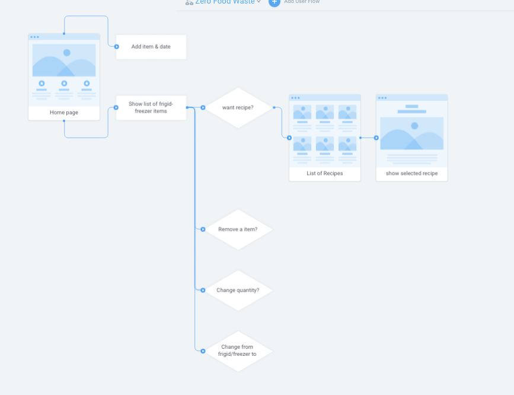
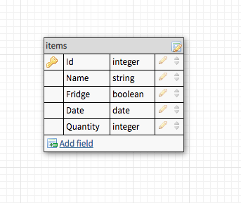
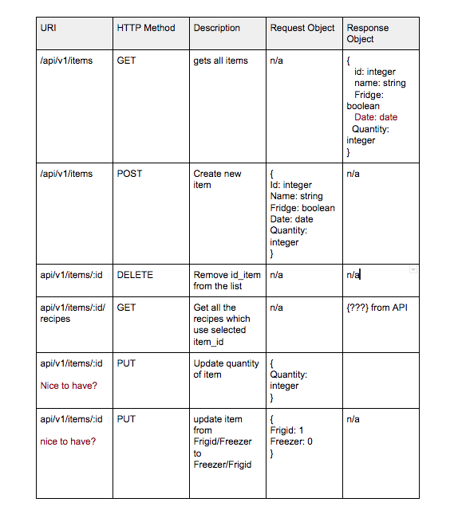
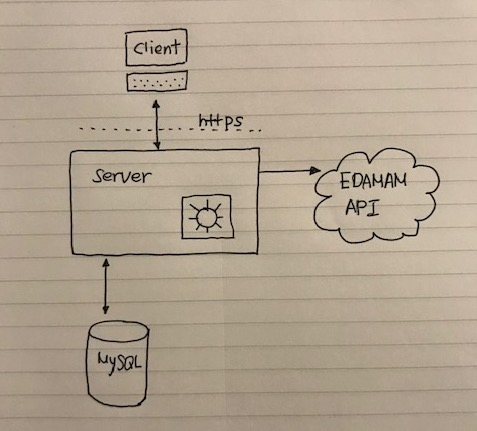

# my-fridge
MyFridge is an app which will help you to avoid food waste from your fridge.

## Features
  - [ ] Principle Features
    - Add item, date and quantity to the fridge or freezer
    - Show the list of items in fridge and freezer by date order (from the oldest to the latest)
    - Can remove item from the fridge or freezer
    - If click an item, show possible recipes and can chose one to show detail.

  - [ ] Nice-to-have
    - Update quantity
    - Move an item from fridge/freezer to freezer/fridge
    - show the list with defualt image of each item

## Stack
MyFridge is using HTML, CSS, React for frontend and Express and MySQL for backend

## API
[EDAMAM](https://developer.edamam.com/edamam-docs-recipe-api)

## Plan
  - [ ] User Flow
  
   
   
   
  
  - [ ] Database schema
  
   
   
   
  
  - [ ] API routes plan
  
   
   
   
  
  - [ ] Full stack architecture drawing
  
   

_This is a student project that was created at [Codely](http://codely.tech), a full stack development bootcamp in Barcelona._

