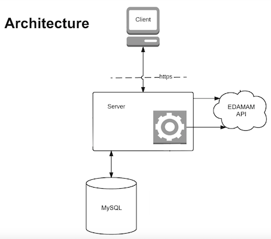

# MY FRIDGE
MyFridge is an app which will help you to avoid food waste from your fridge.

## FEATURES
  ### Principle Features
  - Add item, type, quantity and date to the fridge or freezer
  - Show the list of items in fridge and freezer by date order
  - Sort items by category
  - Show alert when items are close to expiration
  - Can remove item from the fridge or freezer
  - Show possible recipes and can chose one to show detail.

  ### Feature Features
  - Update quantity
  - Move an item from fridge/freezer to freezer/fridge
  - Show the list with default image of each item

## STACK
MyFridge is built using React, Express, Node.js, MySQL and Bootstrap.

## API
[EDAMAM](https://developer.edamam.com/edamam-docs-recipe-api) Recipe Search API

## PLAN
  ### User Flow
  
   
  
  ### Database schema
  
   

  ### API routes
  
   
  
  ### Full stack architecture
  
   

## SETUP

### Dependencies
Run `yarn` to install dependencies.

### Database Preparation
- Create `.env` file in the api directory and add `DB_PASS=YOURPASSWORD` and `DB_NAME=myFridge`.

- Copy `mysql -u root -p -e "create database myFridge"` into your terminal to create a database in MySQL.

- Copy `CREATE TABLE items (id INT(11) NOT NULL AUTO_INCREMENT, name VARCHAR(20) not null, type TINYINT(1) NOT NULL, fridge Boolean NOT NULL, date DATE, quantity INT(11), PRIMARY KEY (id));`into your terminal. This will create a new table named "items" with columns (id, name, type, fridge, date, quantity).

### Begin
Run `yarn start` in your terminal .

_This is a student project that was created at [Codely](http://codely.tech), a full stack development bootcamp in Barcelona._

